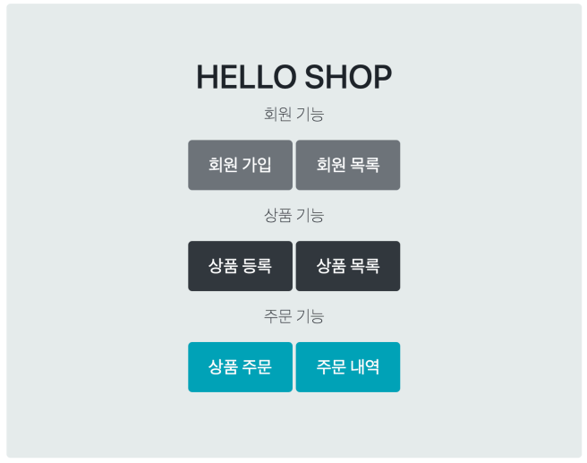
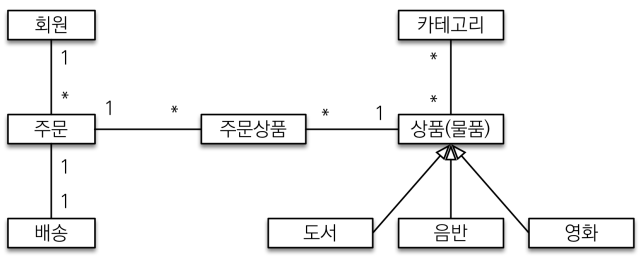
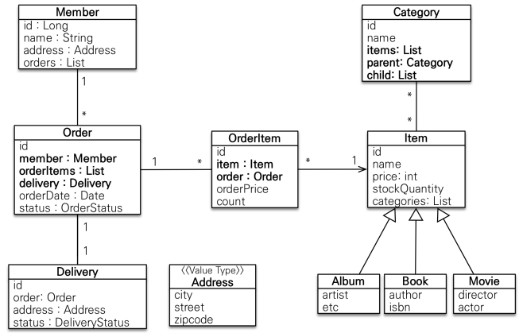
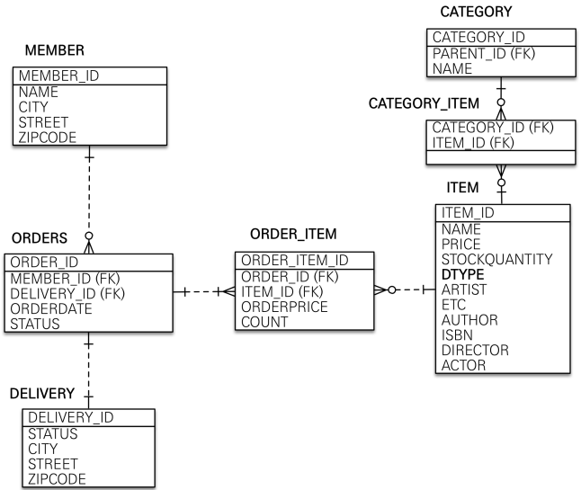

# 2. 도메인 분석 설계

## 요구사항 분석
페이지  
  

기능 목록
- 회원 기능
  - 회원 등록
  - 회원 조회
- 상품 기능 
  - 상품 등록 
  - 상품 수정 
  - 상품 조회 
- 주문 기능 
  - 상품 주문 
  - 주문 내역 조회 
  - 주문 취소 
- 기타 요구사항 
  - 상품은 재고 관리가 필요하다. 
  - 상품의 종류는 도서, 음반, 영화가 있다. 
  - 상품을 카테고리로 구분할 수 있다. 
  - 상품 주문시 배송 정보를 입력할 수 있다.
---
## 도메인 모델과 테이블 설계

  

**회원, 주문, 상품의 관계**  
- 회원은 여러 상품을 주문할 수 있다. 그리고 한 번 주문할 때 여러 상품을 선택할 수 있으므로 주문과 상품은 다대다 관계다.
- 하지만 이런 다대다 관계는 관계형 데이터베이스는 물론이고 엔티티에서도 거의 사용하지 않는다.
- 따라서 그림처럼 주문상품이라는 엔티티를 추가해서 다대다 관계를 일대다, 다대일 관계로 풀어냈다.

**상품 분류**
- 상품은 도서, 음반, 영화로 구분되는데 상품이라는 공통 속성을 사용하므로 상속 구조로 표현했다.  

### 회원 엔티티 분석
  
- **회원(Member)**: 이름과 임베디드 타입인 주소( `Address` ), 그리고 주문( `orders` ) 리스트를 가진다.


- **주문(Order)**: 한 번 주문시 여러 상품을 주문할 수 있으므로 주문과 주문상품( `OrderItem` )은 일대다 관계다.
  - 주문은 상품을 주문한 회원과 배송 정보, 주문 날짜, 주문 상태( `status` )를 가지고 있다.
  - 주문 상태는 열거형을 사용했는데 주문( `ORDER` ), 취소( `CANCEL` )을 표현할 수 있다.


- **주문상품(OrderItem)**: 주문한 상품 정보와 주문 금액( `orderPrice` ), 주문 수량( `count` ) 정보를 가지고 있다. (보통 `OrderLine` , `LineItem` 으로 많이 표현한다.)


- **상품(Item)**: 이름, 가격, 재고수량( `stockQuantity` )을 가지고 있다. 
  - 상품을 주문하면 재고수량이 줄어든다. 
  - 상품의 종류로는 도서, 음반, 영화가 있는데 각각은 사용하는 속성이 조금씩 다르다.


- **배송(Delivery)**: 주문시 하나의 배송 정보를 생성한다. 
  - 주문과 배송은 일대일 관계다.


- **카테고리(Category)**: 상품과 다대다 관계를 맺는다. 
  - `parent` , `child` 로 부모, 자식 카테고리를 연결한다.


- **주소(Address)**: 값 타입(임베디드 타입)이다. 
  - 회원과 배송(Delivery)에서 사용한다.

> 참고: 엔티티 분석 그림에서 Order와 Delivery가 단방향 관계로 잘못 그려져 있다. 양방향 관계가 맞다

> 참고: 회원이 주문을 하기 때문에, 회원이 주문리스트를 가지는 것은 얼핏 보면 잘 설계한 것 같지만, 객체 세상은 실제 세계와는 다르다.   
> 실무에서는 회원이 주문을 참조하지 않고, 주문이 회원을 참조하는 것으로 충분하다.  
> 여기서는 일대다, 다대일의 양방향 연관관계를 설명하기 위해서 추가했다.

### 회원 테이블 분석
  
- **MEMBER**: 회원 엔티티의 Address 임베디드 타입 정보가 회원 테이블에 그대로 들어갔다. 이것은 `DELIVERY` 테이블도 마찬가지다.


- **ITEM**: 앨범, 도서, 영화 타입을 통합해서 하나의 테이블로 만들었다. `DTYPE` 컬럼으로 타입을 구분한다.

### 연관관계 매핑 분석
- **회원과 주문**: 일대다 , 다대일의 양방향 관계다. 따라서 연관관계의 주인을 정해야 하는데, 외래 키가 있는 주문을 연관 관계의 주인으로 정하는 것이 좋다. 그러므로 `Order.member` 를 `ORDERS.MEMBER_ID` 외래 키와 매핑한다.


- **주문상품과 주문**: 다대일 양방향 관계다. 외래 키가 주문상품에 있으므로 주문상품이 연관관계의 주인이다. 그러므로 `OrderItem.order` 를 `ORDER_ITEM.ORDER_ID` 외래 키와 매핑한다.


- **주문상품과 상품**: 다대일 단방향 관계다. `OrderItem.item` 을 `ORDER_ITEM.ITEM_ID` 외래 키와 매핑한다.


- **주문과 배송**: 일대일 양방향 관계다. `Order.delivery` 를 `ORDERS.DELIVERY_ID` 외래 키와 매핑한다.


- **카테고리와 상품**: `@ManyToMany` 를 사용해서 매핑한다.(실무에서 @ManyToMany는 사용하지 말자. 여기서는 다대다 관계를 예제로 보여주기 위해 추가했을 뿐이다)
---
## 엔티티 클래스 개발
- 예제에서는 설명을 쉽게하기 위해 엔티티 클래스에 Getter, Setter를 모두 열고, 최대한 단순하게 설계
- 실무에서는 가급적 Getter는 열어두고, Setter는 꼭 필요한 경우에만 사용하는 것을 추천

**회원 엔티티 (Member)**
```java
package jpabook.jpashop.domain;

import jakarta.persistence.*;
import lombok.Getter;
import lombok.Setter;

import java.util.List;
import java.util.ArrayList;

@Entity
@Getter @Setter
public class Member {

    @Id @GeneratedValue
    @Column(name = "member_id")
    private Long id;
    private String name;

    @Embedded
    private Address address;
    @OneToMany(mappedBy = "member")
    private List<Order> orders = new ArrayList<>();

}
```

> 참고: 엔티티의 식별자는 `id` 를 사용하고 PK 컬럼명은 `member_id` 를 사용했다. 엔티티는 타입(여기서는 `Member` )이 있으므로 `id` 필드만으로 쉽게 구분할 수 있다. 테이블은 타입이 없으므로 구분이 어렵다.  
> 그리고 테이블은 관례상 `테이블명 + id` 를 많이 사용한다. 참고로 객체에서 `id` 대신에 `memberId` 를 사용해도 된다.  
> **중요한 것은 일관성이다.**


**주문 엔티티 (Order)**
```java
package jpabook.jpashop.domain;

import jakarta.persistence.*;
import lombok.Getter;
import lombok.Setter;

import java.time.LocalDateTime;
import java.util.ArrayList;
import java.util.List;

@Entity
@Table(name = "orders")
@Getter @Setter
public class Order {
    
    @Id @GeneratedValue 
    @Column(name = "order_id") 
    private Long id;
    
    @ManyToOne(fetch = FetchType.LAZY) 
    @JoinColumn(name = "member_id") 
    private Member member; //주문 회원
  
    @OneToMany(mappedBy = "order", cascade = CascadeType.ALL) 
    private List<OrderItem> orderItems = new ArrayList<>();
    
    @OneToOne(cascade = CascadeType.ALL, fetch = FetchType.LAZY) 
    @JoinColumn(name = "delivery_id") 
    private Delivery delivery; //배송정보
  
    private LocalDateTime orderDate; //주문시간
  
    @Enumerated(EnumType.STRING)
    private OrderStatus status; //주문상태 [ORDER, CANCEL]

    public void setMember(Member member) {
        this.member = member;
        member.getOrders().add(this);
    }

    public void addOrderItem(OrderItem orderItem) {
        orderItems.add(orderItem);
        orderItem.setOrder(this);
    }

    public void setDelivery(Delivery delivery) {
        this.delivery = delivery;
        delivery.setOrder(this);
    }
}
```

**주문상태 (OrderStatus)**
```java
package jpabook.jpashop.domain;

public enum OrderStatus {
    ORDER, CANCEL
}
```

**주문상품 엔티티 (OrderItem)**
```java
package jpabook.jpashop.domain;

import jakarta.persistence.*;
import jpabook.jpashop.domain.item.Item;
import lombok.Getter;
import lombok.Setter;

@Entity
@Table(name = "order_item")
@Getter @Setter
public class OrderItem {

    @Id @GeneratedValue
    @Column(name = "order_item_id")
    private Long id;

    @ManyToOne(fetch = FetchType.LAZY)
    @JoinColumn(name = "item_id")
    private Item item; //주문 상품

    @ManyToOne(fetch = FetchType.LAZY)
    @JoinColumn(name = "order_id")
    private Order order; //주문

    private int orderPrice; //주문 가격
    private int count; //주문 수량
}
```

**상품 엔티티 (Item)**
```java
package jpabook.jpashop.domain.item;

import lombok.Getter;
import lombok.Setter;

import jpabook.jpashop.domain.Category;
import jakarta.persistence.*;
import java.util.ArrayList;
import java.util.List;

@Entity
@Inheritance(strategy = InheritanceType.SINGLE_TABLE)
@DiscriminatorColumn(name = "dtype")
@Getter @Setter
public abstract class Item {
    
    @Id @GeneratedValue
    @Column(name = "item_id")
    private Long id;
    private String name;
    private int price;
    private int stockQuantity;
    
    @ManyToMany(mappedBy = "items")
    private List<Category> categories = new ArrayList<Category>();
}
```

**상품 - 도서 엔티티 (Book)**
```java
package jpabook.jpashop.domain.item;
import lombok.Getter;
import lombok.Setter;

import jakarta.persistence.DiscriminatorValue;
import jakarta.persistence.Entity;

@Entity
@DiscriminatorValue("B")
@Getter @Setter
public class Book extends Item {
    
    private String author;
    private String isbn;
    
}
```

**상품 - 음반 엔티티 (Album)**
```java
package jpabook.jpashop.domain.item;

import jakarta.persistence.DiscriminatorValue;
import jakarta.persistence.Entity;

import lombok.Getter;
import lombok.Setter;

@Entity
@DiscriminatorValue("A")
@Getter @Setter
public class Album extends Item {

    private String artist;
    private String etc;

}
```

**상품 - 영화 엔티티 (Movie)**
```java
package jpabook.jpashop.domain.item;

import jakarta.persistence.DiscriminatorValue;
import jakarta.persistence.Entity;

import lombok.Getter;
import lombok.Setter;

@Entity
@DiscriminatorValue("M")
@Getter @Setter
public class Movie extends Item {

    private String director;
    private String actor;

}
```

**배송 엔티티 (Delivery)**
```java
package jpabook.jpashop.domain;

import lombok.Getter;
import lombok.Setter;

import jakarta.persistence.*;

@Entity
@Getter @Setter
public class Delivery {
    @Id @GeneratedValue
    @Column(name = "delivery_id")
    private Long id;

    @OneToOne(mappedBy = "delivery", fetch = FetchType.LAZY)
    private Order order;

    @Embedded
    private Address address;

    @Enumerated(EnumType.STRING)
    private DeliveryStatus status; //ENUM [READY(준비), COMP(배송)]
}
```

**배송 상태 (DeliveryStatus)**
```java
package jpabook.jpashop.domain;

public enum DeliveryStatus {
    READY, COMP
}
```

**카테고리 엔티티 (Category)**
```java
package jpabook.jpashop.domain;

import jakarta.persistence.*;
import jpabook.jpashop.domain.item.Item;
import lombok.Getter;
import lombok.Setter;

import java.util.ArrayList;
import java.util.List;

@Entity
@Getter @Setter
public class Category {

    @Id @GeneratedValue
    @Column(name = "category_id")
    private Long id;
    private String name;

    @ManyToMany
    @JoinTable(name = "category_item",
    joinColumns = @JoinColumn(name = "category_id"),
    inverseJoinColumns = @JoinColumn(name = "item_id"))
    private List<Item> items = new ArrayList<>();

    @ManyToOne(fetch = FetchType.LAZY)
    @JoinColumn(name = "parent_id")
    private Category parent;

    @OneToMany(mappedBy = "parent")
    private List<Category> child = new ArrayList<>();

    //==연관관계 메서드==//
    public void addChildCategory(Category child) {
        this.child.add(child);
        child.setParent(this);
    }
}
```

> 참고: **실무에서는 `@ManyToMany` 를 사용하지 말자**  
`@ManyToMany` 는 편리한 것 같지만, 중간 테이블( `CATEGORY_ITEM` )에 컬럼을 추가할 수 없고, 세밀하게 쿼리를 실행하기 어렵기 때문에 실무에서 사용하기에는 한계가 있다.  
> 중간 엔티티( `CategoryItem` 를 만들고 `@ManyToOne` , `@OneToMany` 로 매핑해서 사용하자.  
> **정리하면 다대다 매핑을 일대다, 다대일 매핑으로 풀어내서 사용하자.**

**주소 값 타입**
```java
package jpabook.jpashop.domain;

import lombok.Getter;
import lombok.Setter;

import jakarta.persistence.Embeddable;

@Embeddable
@Getter
public class Address {
    private String city;
    private String street;
    private String zipcode;

    protected Address() {
    }

    public Address(String city, String street, String zipcode) {
        this.city = city;
        this.street = street;
        this.zipcode = zipcode;
    }
}
```

> 참고: **값 타입은 변경 불가능하게 설계해야 한다.**  
`@Setter` 를 제거하고, 생성자에서 값을 모두 초기화해서 변경 불가능한 클래스를 만들자.  
> JPA 스펙상 엔티티나 임베디드 타입( `@Embeddable` )은 자바 기본 생성자(default constructor)를 `public` 또는 `protected` 로 설정해야 한다.  
> `public` 으로 두는 것 보다는 `protected` 로 설정하는 것이 그나마 더 안전하다.
> JPA가 이런 제약을 두는 이유는 JPA 구현 라이브러리가 객체를 생성할 때 리플랙션 같은 기술을 사용할 수 있도록 지원해야 하기 때문이다.

