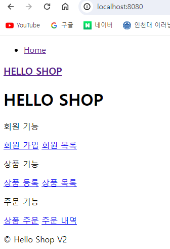
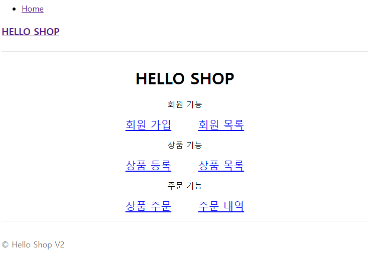

# 웹 계층 개발


## 홈 화면과 레이아웃
### 홍 컨트롤러 등록
```java
package jpabook.jpashop.web;

import lombok.extern.slf4j.Slf4j;
import org.springframework.stereotype.Controller;
import org.springframework.web.bind.annotation.RequestMapping;

@Controller@Slf4j
public class HomeController {

    @RequestMapping("/")
    public String home() {
        log.info("home controller");
        return "home";
    }
}
```
스프링 부트 타임리프 기본 설정
```yaml
spring:
  thymeleaf:
    prefix: classpath:/templates/
    suffix: .html
```

- 스프링 부트 타임리프 viewName 매핑
  - `resources:templates/` +{ViewName}+ `.html`
  - `resources:templates/home.html`

반환한 문자( `home` )과 스프링부트 설정 `prefix` , `suffix` 정보를 사용해서 렌더링할 뷰( `html` )를 찾는다.

### 타임리프 템플릿 등록
`home.html`
```html
<!DOCTYPE HTML>
<html xmlns:th="http://www.thymeleaf.org">
<head th:replace="fragments/header :: header">
    <title>Hello</title>
    <meta http-equiv="Content-Type" content="text/html; charset=UTF-8" />
</head>
<body>
<div class="container">
    <div th:replace="fragments/bodyHeader :: bodyHeader" />
    <div class="jumbotron">
        <h1>HELLO SHOP</h1>
        <p class="lead">회원 기능</p>
        <p>
            <a class="btn btn-lg btn-secondary" href="/members/new">회원 가입</a>
            <a class="btn btn-lg btn-secondary" href="/members">회원 목록</a>
        </p>
        <p class="lead">상품 기능</p>
        <p>
            <a class="btn btn-lg btn-dark" href="/items/new">상품 등록</a>
            <a class="btn btn-lg btn-dark" href="/items">상품 목록</a>
        </p>
        <p class="lead">주문 기능</p>
        <p>
            <a class="btn btn-lg btn-info" href="/order">상품 주문</a>
            <a class="btn btn-lg btn-info" href="/orders">주문 내역</a>
        </p>
    </div>
    <div th:replace="fragments/footer :: footer" />
</div> <!-- /container -->
</body>
</html>
```

**fragments/header.html**
```html
<!DOCTYPE html>
<html xmlns:th="http://www.thymeleaf.org">
<head th:fragment="header">
  <!-- Required meta tags -->
  <meta charset="utf-8">
  <meta name="viewport" content="width=device-width, initial-scale=1, shrinkto-fit=no">
  <!-- Bootstrap CSS -->
  <link rel="stylesheet" href="/css/bootstrap.min.css" integrity="sha384-ggOyR0iXCbMQv3Xipma34MD+dH/1fQ784/j6cY/iJTQUOhcWr7x9JvoRxT2MZw1T" crossorigin="anonymous">
  <!-- Custom styles for this template -->
  <link href="/css/jumbotron-narrow.css" rel="stylesheet">
  <title>Hello, world!</title>
</head>
```

**fragments/bodyHeader.html**
```html
<!DOCTYPE html>
<html xmlns:th="http://www.thymeleaf.org">
<div class="header" th:fragment="bodyHeader">
  <ul class="nav nav-pills pull-right">
    <li><a href="/">Home</a></li>
  </ul>
  <a href="/"><h3 class="text-muted">HELLO SHOP</h3></a>
</div>
```

**fragments/footer.html**
```html
<!DOCTYPE html>
<html xmlns:th="http://www.thymeleaf.org">
<div class="footer" th:fragment="footer">
  <p>&copy; Hello Shop V2</p>
</div>
```

  
H2를 키고, JpashopApplication 실행 후 localhost:8080 에 들어가면 이제 이런 화면이 나온다.
순수한 html만 적용돼 있다.

> 참고: 뷰 템플릿 변경사항을 서버 재시작 없이 즉시 반영하기
> 1. spring-boot-devtools 추가 ( `implementation 'org.springframework.boot:spring-boot-devtools'` )
> 2. html 파일 build -> Recompile

### view 리소스 등록
이쁜 디자인을 위해 부트스트랩을 사용하겠다. (https://getbootstrap.com/)  

- `resources/static` 하위에 css , js 추가
- `resources/static/css/jumbotron-narrow.css` 추가

jumbotron-narrow.css 파일
```css
/* Space out content a bit */
body {
    padding-top: 20px;
    padding-bottom: 20px;
}
/* Everything but the jumbotron gets side spacing for mobile first views */
.header,
.marketing,
.footer {
    padding-left: 15px;
    padding-right: 15px;
}
/* Custom page header */
.header {
    border-bottom: 1px solid #e5e5e5;
}
/* Make the masthead heading the same height as the navigation */
.header h3 {
    margin-top: 0;
    margin-bottom: 0;
    line-height: 40px;
    padding-bottom: 19px;
}
/* Custom page footer */
.footer {
    padding-top: 19px;
    color: #777;
    border-top: 1px solid #e5e5e5;
}
/* Customize container */
@media (min-width: 768px) {
    .container {
        max-width: 730px;
    }
}
.container-narrow > hr {
    margin: 30px 0;
}
/* Main marketing message and sign up button */
.jumbotron {
    text-align: center;
    border-bottom: 1px solid #e5e5e5;
}
.jumbotron .btn {
    font-size: 21px;
    padding: 14px 24px;
}
/* Supporting marketing content */
.marketing {
    margin: 40px 0;
}
.marketing p + h4 {
    margin-top: 28px;
}
/* Responsive: Portrait tablets and up */
@media screen and (min-width: 768px) {
    /* Remove the padding we set earlier */
    .header,
    .marketing,
    .footer {
        padding-left: 0;
        padding-right: 0;
    }
    /* Space out the masthead */
    .header {
        margin-bottom: 30px;
    }
    /* Remove the bottom border on the jumbotron for visual effect */
    .jumbotron {
        border-bottom: 0;
    }
}
```

bootstrap 버전이 달라서 강의와는 다르지만 변하긴 변했다.  


이제 기능을 추가해보자.  

---
## 회원 추가
- 폼 객체를 사용해 화면 계층과 서비스 계층을 명확하게 분리한다.

**회원 등록 폼 객체**
```java
package jpabook.jpashop.web;

import jakarta.validation.constraints.NotEmpty;
import lombok.Getter;
import lombok.Setter;

@Getter @Setter
public class MemberForm {

    @NotEmpty(message = "회원 이름은 필수입니다.")
    private String name;

    private String city;
    private String street;
    private String zipcode;
}
```

**회원 등록 컨트롤러**
```java
package jpabook.jpashop.web;

import jakarta.validation.Valid;
import jpabook.jpashop.domain.Address;
import jpabook.jpashop.domain.Member;
import jpabook.jpashop.service.MemberService;
import lombok.RequiredArgsConstructor;
import org.springframework.stereotype.Controller;
import org.springframework.ui.Model;
import org.springframework.validation.BindingResult;
import org.springframework.web.bind.annotation.GetMapping;
import org.springframework.web.bind.annotation.PostMapping;

@Controller
@RequiredArgsConstructor
public class MemberController {

    private final MemberService memberService;

    @GetMapping(value = "/members/new")
    public String createForm(Model model) {
        model.addAttribute("memberForm", new MemberForm());
        return "members/createMemberForm";
    }

    @PostMapping(value = "/members/new")
    public String create(@Valid MemberForm form, BindingResult result) {
        
        if (result.hasErrors()) {
            return "members/createMemberForm";
        }
        
        Address address = new Address(form.getCity(), form.getStreet(), form.getZipcode());
        Member member = new Member();
        member.setName(form.getName());
        member.setAddress(address);
        
        memberService.join(member);
        
        return "redirect:/";
    }
}
```

회원 등록 폼 화면( `templates/members/createMemberForm.html` )
```html
<!DOCTYPE HTML>
<html xmlns:th="http://www.thymeleaf.org">
<head th:replace="fragments/header :: header" />
<style>
  .fieldError {
    border-color: #bd2130;
  }
</style>
<body>
<div class="container">
  <div th:replace="fragments/bodyHeader :: bodyHeader"/>
  <form role="form" action="/members/new" th:object="${memberForm}"
        method="post">
    <div class="form-group">
      <label th:for="name">이름</label>
      <input type="text" th:field="*{name}" class="form-control"
             placeholder="이름을 입력하세요"
             th:class="${#fields.hasErrors('name')}? 'form-control
fieldError' : 'form-control'">
      <p th:if="${#fields.hasErrors('name')}"
         th:errors="*{name}">Incorrect date</p>
    </div>
    <div class="form-group">
      <label th:for="city">도시</label>
      <input type="text" th:field="*{city}" class="form-control"
             placeholder="도시를 입력하세요">
    </div>
    <div class="form-group">
      <label th:for="street">거리</label>
      <input type="text" th:field="*{street}" class="form-control"
             placeholder="거리를 입력하세요">
    </div>
    <div class="form-group">
      <label th:for="zipcode">우편번호</label>
      <input type="text" th:field="*{zipcode}" class="form-control"
             placeholder="우편번호를 입력하세요">
    </div>
    <button type="submit" class="btn btn-primary">Submit</button>
  </form>
  <br/>
  <div th:replace="fragments/footer :: footer" />
</div> <!-- /container -->
</body>
</html><!DOCTYPE HTML>
<html xmlns:th="http://www.thymeleaf.org">
<head th:replace="fragments/header :: header" />
<style>
  .fieldError {
    border-color: #bd2130;
  }
</style>
<body>
<div class="container">
  <div th:replace="fragments/bodyHeader :: bodyHeader"/>
  <form role="form" action="/members/new" th:object="${memberForm}"
        method="post">
    <div class="form-group">
      <label th:for="name">이름</label>
      <input type="text" th:field="*{name}" class="form-control"
             placeholder="이름을 입력하세요"
             th:class="${#fields.hasErrors('name')}? 'form-control
fieldError' : 'form-control'">
      <p th:if="${#fields.hasErrors('name')}"
         th:errors="*{name}">Incorrect date</p>
    </div>
    <div class="form-group">
      <label th:for="city">도시</label>
      <input type="text" th:field="*{city}" class="form-control"
             placeholder="도시를 입력하세요">
    </div>
    <div class="form-group">
      <label th:for="street">거리</label>
      <input type="text" th:field="*{street}" class="form-control"
             placeholder="거리를 입력하세요">
    </div>
    <div class="form-group">
      <label th:for="zipcode">우편번호</label>
      <input type="text" th:field="*{zipcode}" class="form-control"
             placeholder="우편번호를 입력하세요">
    </div>
    <button type="submit" class="btn btn-primary">Submit</button>
  </form>
  <br/>
  <div th:replace="fragments/footer :: footer" />
</div> <!-- /container -->
</body>
</html>
```