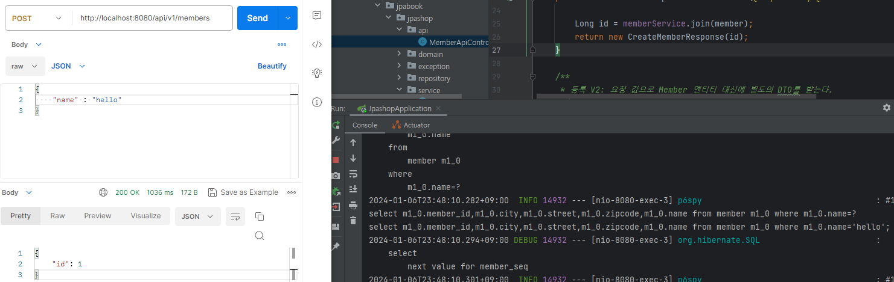
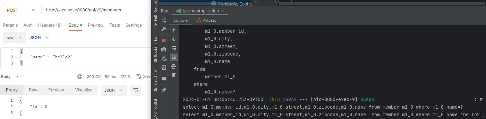

readme 파일은 활용편 1, readme2 파일은 2를 정리한 README 파일이다.

# API 개발 기본

## 회원 등록 API
- postman 를 설치해 준비하자. (https://www.getpostman.com)

### 회원 등록 API (V1)
```java
package jpabook.jpashop.api;

import jakarta.validation.Valid;
import jpabook.jpashop.domain.Member;
import jpabook.jpashop.service.MemberService;
import lombok.Data;
import lombok.RequiredArgsConstructor;
import org.springframework.web.bind.annotation.PostMapping;
import org.springframework.web.bind.annotation.RequestBody;
import org.springframework.web.bind.annotation.RestController;

@RestController
@RequiredArgsConstructor
public class MemberApiController {
    
    private final MemberService memberService;
    
    /**
     * 등록 V1: 요청 값으로 Member 엔티티를 직접 받는다.
     */

    @PostMapping("/api/v1/members")
    public CreateMemberResponse saveMemberV1(@RequestBody @Valid Member member) {

        Long id = memberService.join(member);
        return new CreateMemberResponse(id);
    }

    @Data
    static class CreateMemberRequest {
        private String name;
    }

    @Data
    static class CreateMemberResponse {
        private Long id;
        public CreateMemberResponse(Long id) {
            this.id = id;
        }
    }
}
```

#### V1 : 엔티티를 Request Body에 직접 매핑

postman 으로 해봤다. name='hello'로 보이는 것을 확인할 수 있었다.

**문제점**
- 엔티티에 프레젠테이션 계층을 위한 로직이 추가된다.
- 엔티티에 API 검증을 위한 로직이 들어간다. (@NotEmpty 등등)
- 실무에서는 회원 엔티티를 위한 API가 다양하게 만들어지는데, 한 엔티티에 각각의 API를 위한 모든 요청 요구사항을 담기는 어렵다.
- 엔티티가 변경되면 API 스펙이 변한다.

**결론**
- API 요청 스펙에 맞추어 별도의 DTO를 파라미터로 받는다.

---
## V2 : 엔티티 대신에 DTO를 RequestBody에 매핑
```java
    /**
    * 등록 V2: 요청 값으로 Member 엔티티 대신에 별도의 DTO를 받는다.
    */
    @PostMapping("/api/v2/members")
    public CreateMemberResponse saveMemberV2(@RequestBody @Valid CreateMemberRequest request) {
        Member member = new Member();
        member.setName(request.getName());
        Long id = memberService.join(member);
        return new CreateMemberResponse(id);
    }
```



- `CreateMemberRequest` 를 `Member` 엔티티 대신에 RequestBody와 매핑한다.
- V2의 장점
  - 엔티티와 프레젠테이션 계층을 위한 로직을 분리할 수 있다.
  - 엔티티와 API 스펙을 명확하게 분리할 수 있다.
  - 엔티티가 변해도 API 스펙이 변하지 않는다.

> 실무에서는 엔티티를 API 스펙에 노출하면 안된다!

---
## 회원 수정 API
**MemberApiController 에 추가**
```java
    /**
     * 수정 API
     */
    @PutMapping("/api/v2/members/{id}")
    public UpdateMemberResponse updateMemberV2(@PathVariable("id") Long id, @RequestBody @Valid UpdateMemberRequest request) {
        memberService.update(id, request.getName());
        Member findMember = memberService.findOne(id);
        return new UpdateMemberResponse(findMember.getId(), findMember.getName());
    }
    @Data
    static class UpdateMemberRequest {
        private String name;
    }
    @Data
    @AllArgsConstructor
    static class UpdateMemberResponse {
        private Long id;
        private String name;
    }
```

회원 수정 또한 V2와 마찬가지로 요청 파라미터에 매핑한다.

**MemberService 코드에 추가**
```java
    /**
     * 회원 수정
     */
    @Transactional
    public void update(Long id, String name) {
        Member member = memberRepository.findOne(id);
        member.setName(name);
    }
```

> 회원 수정 API updateMemberV2 은 회원 정보를 부분 업데이트 한다.  
> 여기서 PUT 방식을 사용했는데, **PUT은 전체 업데이트**를 할 때 사용하는 것이 맞다.  
> **부분 업데이트를 하려면 PATCH를 사용하거나 POST를 사용하는 것이 REST 스타일에 맞다.**

---