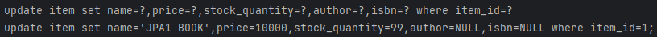
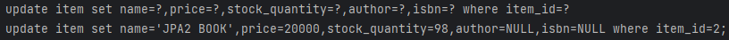

# API 개발 고급 - 준비

현업에서 성능이 안 나와서 튜닝을 하는데
- 조회용 샘플 데이터 입력
- 지연 로딩과 조회 성능 최적화
- 컬렉션 조회 최적화
- 페이징과 한계 돌파
- OSIV와 성능 최적화

샘플 데이터 입력을 제외한 4가지가 문제인 경우가 많다. -> 쿼리가 너무 많이 나갈 때 시간이 오래 걸려서 문제가 된다.  
위 4가지를 해결하면 시간을 많이 줄일 수 있다.  

1. 초기화를 막기 위한 조회용 샘플 데이터를 입력한다.
2. 지연 로딩과 조회 성능 최적화 : JPA 쓰면서 N+1 문제를 겪게 된다.
   1. 쿼리 1, 2번이면 해결이 될게 최적화하지 않으면 수십 번으로 늘게돼 성능에 좋지 않음. -> 이걸 해결한다.
3. 컬렉션 조회 최적화
   1. 1대1, 다대1처럼 조인을 했는데도 데이터가 안 드러나는 경우 : 성능에 이슈가 없다.
   2. 1대다 인 경우 : 데이터가 뻥튀기돼 늘게 돼 좋지 않다.
4. 페이징과 한계 돌파
   1. 페이징 쿼리 : 1대다 조인을 하게 되면 DB입장에서 뻥튀기가 된다.
   2. ex) 회원-주문에서 회원 1, 주문 2일 때 : 회원을 기준으로 페이징할 때 데이터가 2배로 늘게 된다.
   3. 이러한 한계를 돌파하는 방법에 대해 배운다.
5. OSIV와 성능 최적화
   1. 이것을 실무 때 어떻게 사용하는 것이 좋을지 배운다.

---
## 조회용 샘플 데이터 입력

- userA
  - JPA1 BOOK
  - JPA2 BOOK
- userB
  - SPRING1 BOOK
  - SPRING2 BOOK
```java
package jpabook.jpashop;

import jakarta.annotation.PostConstruct;
import jakarta.persistence.EntityManager;
import jpabook.jpashop.domain.*;
import jpabook.jpashop.domain.item.Book;
import lombok.RequiredArgsConstructor;
import org.springframework.stereotype.Component;
import org.springframework.transaction.annotation.Transactional;

/**
 * userA
 *   JPA1 BOOK
 *   JPA2 BOOK
 * userB
 *   SPRING1 BOOK
 *   SPRING2 BOOK
 */
@Component
@RequiredArgsConstructor
public class InitDb {

    private final InitService initService;

    @PostConstruct
    public void init() {
        initService.dbInit1();
    }

    @Component
    @Transactional
    @RequiredArgsConstructor
    static class InitService {

        private final EntityManager em;

        public void dbInit1() {
            Member member = createMember("userA", "서울", "1", "1111");
            em.persist(member);

            Book book1 = createBook("JPA1 BOOK", 10000, 100);
            em.persist(book1);

            Book book2 = createBook("JPA2 BOOK", 20000, 100);
            em.persist(book2);

            OrderItem orderItem1 = OrderItem.createOrderItem(book1, 10000, 1);
            OrderItem orderItem2 = OrderItem.createOrderItem(book2, 20000, 2);
            Order order = Order.createOrder(member, createDelivery(member), orderItem1, orderItem2);
            // Order 에서 createOrder는 orderItem이 여러 개 넣을 수 있게끔 ...으로 해뒀던걸 기억하자.
            em.persist(order);
        }

        private Member createMember(String name, String city, String street, String zipcode) {
            Member member = new Member();
            member.setName(name);
            member.setAddress(new Address(city, street, zipcode));
            return member;
        }

        private Book createBook(String name, int price, int stockQuantity) {
            Book book = new Book();
            book.setName(name);
            book.setPrice(price);
            book.setStockQuantity(stockQuantity);
            return book;
        }

        private Delivery createDelivery(Member member) {
            Delivery delivery = new Delivery();
            delivery.setAddress(member.getAddress());
            return delivery;
        }
    }
}
```

   
   


userA와 함께 확인해보니 잘 된 것을 볼 수 있었다.  
  
주문목록을 보면 대표상품 이름으로 1개만 되어 있는데 주문은 2개가 들어가 있다.
DB데이터 상으로는 2개지만, 1개만 뿌린 것이다. (예제를 단순화하기 위해서)  

dbInit2() 메서드도 추가해본다.  

```java
    @PostConstruct
    public void init() {
        initService.dbInit1();
        initService.dbInit2();
    }

            public void dbInit2() {
            
            Member member = createMember("userB", "진주", "2", "2222");
            em.persist(member);
            
            Book book1 = createBook("SPRING1 BOOK", 20000, 200);
            em.persist(book1);
            
            Book book2 = createBook("SPRING2 BOOK", 40000, 300);
            em.persist(book2);
            
            Delivery delivery = createDelivery(member);
            OrderItem orderItem1 = OrderItem.createOrderItem(book1, 20000, 3);
            OrderItem orderItem2 = OrderItem.createOrderItem(book2, 40000, 4);
            Order order = Order.createOrder(member, delivery, orderItem1, orderItem2);
            em.persist(order);
        }
```

  
order 4, 11이 2개씩인 것을 알 수 있었다.