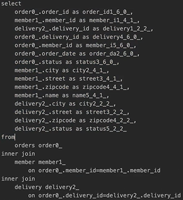
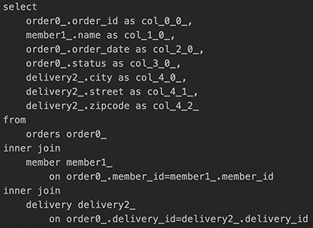
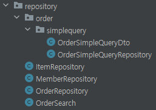

# API 개발 고급 - 지연 로딩과 조회 성능 최적화

**순서**
- /간단한 주문 조회 V1: 엔티티를 직접 노출
- /간단한 주문 조회 V2: 엔티티를 DTO로 변환
- /간단한 주문 조회 V3: 엔티티를 DTO로 변환 - 페치 조인 최적화
- /간단한 주문 조회 V4: JPA에서 DTO로 바로 조회

주문 + 배송정보 + 회원을 조회하는 API를 만들자.  
지연 로딩 때문에 발생하는 성능 문제를 단계적으로 해결해보자.  
(아주 중요한 내용이니 꼭 곱씹어볼 것)  

## 간단한 주문 조회 V1: 엔티티를 직접 노출
OrderSimpleApiController
```java
package jpabook.jpashop.api;

import jpabook.jpashop.domain.Order;
import jpabook.jpashop.domain.OrderSearch;
import jpabook.jpashop.repository.OrderRepository;
import lombok.RequiredArgsConstructor;
import org.springframework.web.bind.annotation.GetMapping;
import org.springframework.web.bind.annotation.RestController;

import java.util.List;

/**
 * xToOne(ManyToOne, OneToOne) 관계 최적화
 * (Order - Member는 ManyToOne 관계다.)
 * (Order - Delivery 는 OneToOne 관계다.)
 * Order
 * Order -> Member
 * Order -> Delivery
 */
@RestController
@RequiredArgsConstructor
public class OrderSimpleApiController {

    private final OrderRepository orderRepository;

    /**
     * V1. 엔티티 직접 노출
     * - Hibernate5Module 모듈 등록, LAZY=null 처리
     * - 양방향 관계 문제 발생 -> @JsonIgnore
     */
    @GetMapping("/api/v1/simple-orders")
    public List<Order> ordersV1() {
        List<Order> all = orderRepository.findAllByString(new OrderSearch());

        // return all; 이것을 바로 하면 문제가 생긴다. -> 왜?

        for (Order order : all) {
            order.getMember().getName(); // Lazy 강제 초기화
            order.getDelivery().getAddress(); // Lazy 강제 초기화
        }

        return all;
    }
}
```

> 주석 처리해둔 곳에서 return all을 하면 오류가 생기는 이유   
> Order에 가보면 json이 Member를 뿌려야 한다. 그래서 Member로 가면 orders가 있다.  
> ```java 
>   @OneToMany(mappedBy = "member")
>   private List<Order> orders = new ArrayList<>();
> ```
> 이것 때문에 끝나지 않고 반복하게 돼 장애가 생긴다.  
> 양방향 관계 문제때문에 -> `@JsonIgnore` 가 필요하다. Member든 Order든. (Delivery, OrderItem도 Order와 관련이 있으니 필요하다.)  
> ```java
>   @JsonIgnore
>   @OneToMany(mappedBy = "member")
>   private List<Order> orders = new ArrayList<>();
> ```
> 위의 `@JsonIgnore` 을 추가해도 오류가 해결되지 않는다. -> 왜?  
> Order를 가지고 왔어도 fetch가 `LAZY`로 되어 있다. (지연 로딩이라는 뜻)  
> ```java
>   @ManyToOne(fetch = FetchType.LAZY)
>   @JoinColumn(name = "member_id")
>   private Member member; //주문 회원
> ```
> 지연 로딩이면 member든 Delivery든 객체를 바로 가져오지 않는다.  
> 로그를 읽어보면 bytebuddy 라는 것을 볼 수 있는데, 객체를 바로 가져오는 것이 아닌, **Proxy 객체를 가져오기 때문이다.**  
> **Json은 이 Proxy 객체를 json으로 어떻게 생성해야 하는지 몰라서 예외가 발생**하는 것이다.  
> (Member만 코드로 해놨지만, OrderItem, Delivery에서도 Order와 관련된 것이라면 `@JsonIgnore`가 필요하다.)

> **해결 방법** : `Hibernate5Module` 을 스프링 빈으로 등록하면 해결


### 하이버네이트 모듈 등록
**스프링 부트 3.0 이상: Hibernate5JakartaModule 등록**
`build.gradle` 에 다음 라이브러리를 추가하자
`implementation 'com.fasterxml.jackson.datatype:jackson-datatype-hibernate5-jakarta'`

`JpashopApplication` 에 다음 코드를 추가하자
```java
    @Bean
    Hibernate5JakartaModule hibernate5Module() {
        return new Hibernate5JakartaModule();
    }
```
- 기본적으로 초기화 된 프록시 객체만 노출, 초기화 되지 않은 프록시 객체는 노출 안함

강제로 지연 로딩을 하는 방법은 이렇게 수정하면 된다.
```java
    @Bean
    Hibernate5JakartaModule hibernate5Module() {
        Hibernate5JakartaModule hibernate5JakartaModule = new Hibernate5JakartaModule();
        // 강제 지연 로딩 설정
        hibernate5JakartaModule.configure(Hibernate5JakartaModule.Feature.FORCE_LAZY_LOADING, true);
        return new Hibernate5JakartaModule();
    }
```

> V1 엔티티 직접 노출하는 것에 대한 이야기이기 때문에 열심히 볼 필요는 없다.

> 참고: 앞에서 계속 강조했듯이 정말 간단한 애플리케이션이 아니면 엔티티를 API 응답으로 외부로 노출하는 것은 좋지 않다.  
> 따라서 `Hibernate5Module` 를 사용하기 보다는 DTO로 변환해서 반환하는 것이 더 좋은 방법이다.

> 주의: 지연 로딩(LAZY)을 피하기 위해 즉시 로딩(EARGR)으로 설정하면 안된다!  
> 즉시 로딩 때문에 연관관계가 필요 없는 경우에도 데이터를 항상 조회해서 성능 문제가 발생할 수 있다.  
> 즉시 로딩으로 설정하면 성능 튜닝이 매우 어려워 진다.  
> 항상 지연 로딩을 기본으로 하고, 성능 최적화가 필요한 경우에는 페치 조인(fetch join)을 사용해라!(V3에서 설명)

---
## 간단한 주문 조회 V2: 엔티티를 DTO로 변환
**OrderSimpleApiController - 추가**
```java
    /**
     * V2. 엔티티를 조회해서 DTO로 변환 (fetch join 사용X)
     * - 단점: 지연로딩으로 쿼리 N번 호출
     */
    @GetMapping("/api/v2/simple-orders")
    public List<SimpleOrderDto> ordersV2() {
        List<Order> orders = orderRepository.findAllByString(new OrderSearch());
        
        List<SimpleOrderDto> result = orders.stream()
                .map(o -> new SimpleOrderDto(o))
                .collect(toList());
        return result;
    }
    @Data
    static class SimpleOrderDto {
        private Long orderId;
        private String name;
        private LocalDateTime orderDate; //주문시간
        private OrderStatus orderStatus;
        private Address address;
        public SimpleOrderDto(Order order) {
            orderId = order.getId();
            name = order.getMember().getName();
            orderDate = order.getOrderDate();
            orderStatus = order.getStatus();
            address = order.getDelivery().getAddress();
        }
    }
```
  
이런 형태로 나온다.  
V1에서는 orderId가 아닌, Id로 엔티티 정보 자체가 나왔었는데 이제는 아니다.  

- 엔티티를 DTO로 변환하는 일반적인 방법이다.
- 하지만 이 방법도 너무 쿼리가 많이 출력돼 아쉽다.
- orderV2는 order 조회 1번, member 조회 1번, delivery 조회 1번으로 끝난다고 생각하지만?
  - 1번째 주문서는 order 1개, member_id 1개, delivery_id 1개만 넘기면서 쿼리 3개로 완성이 된다. 근데 order는 2개 이므로 또 한 번 더 loop를 돌게 된다.
  - 2번째 주문서 (2번째 loop) 는 또 member, delivery를 가져온다. (즉, member와 delivery는 n개의 주문서만큼 n번 가져온다.)
- 쿼리가 총 1 + N + N번 실행된다. (v1과 쿼리수 결과는 같다.)
  - `order` 조회 1번(order 조회 결과 수가 N이 된다.)
  - `order -> member` 지연 로딩 조회 N 번
  - `order -> delivery` 지연 로딩 조회 N 번
  - 예) order의 결과가 4개면 최악의 경우 1 + 4 + 4번 실행된다.(최악의 경우)
    - **지연로딩은 영속성 컨텍스트에서 조회하므로, 이미 조회된 경우 쿼리를 생략한다.**
---
## 간단한 주문 조회 V3: 엔티티를 DTO로 변환 - Fetch join 최적화
**OrderSimpleApiController - 추가**
```java
    /**
     * V3. 엔티티를 조회해서 DTO로 변환(fetch join 사용O)
     * - fetch join으로 쿼리 1번 호출
     * 참고: fetch join에 대한 자세한 내용은 JPA 기본편 참고(정말 중요함)
     */
    @GetMapping("/api/v3/simple-orders")
    public List<SimpleOrderDto> ordersV3() {
        List<Order> orders = orderRepository.findAllWithMemberDelivery();
        List<SimpleOrderDto> result = orders.stream()
                .map(o -> new SimpleOrderDto(o))
                .collect(toList());
        return result;
    }
```

**OrderRepository - 추가 **
```java
    /**
     * 한방 쿼리
     * Order 조회를 하면 member, delivery를 같이 조회해온다.
     */
    public List<Order> findAllWithMemberDelivery() {
        return em.createQuery(
                "select o from Order o" +
                        " join fetch o.member m" +
                        " join fetch o.delivery d", Order.class
        ).getResultList();
    }
```

엔티티를 페치 조인(fetch join)을 사용해서 쿼리 1번에 조회  
V2에서는 n + n 조회로 문제가 있었지만 패치 조인을 하면?  
페치 조인으로 `order -> member` , `order -> delivery` 는 **이미 조회된 상태 이므로 지연로딩 X**  

  
  
from절에는 order를 조회하지만? `order - member`, `order - delivery`조인으로 인해 성능이 빨라졌음을 알 수 있다.
---
## 간단한 주문 조회 V4: JPA에서 DTO로 바로 조회
**OrderSimpleApiController - 추가**
```java
    private final OrderSimpleQueryRepository orderSimpleQueryRepository; //의존관계 주입

    /**
     * V3. 엔티티를 조회해서 DTO로 변환(fetch join 사용O)
     * - fetch join으로 쿼리 1번 호출
     * 참고: fetch join에 대한 자세한 내용은 JPA 기본편 참고(정말 중요함)
     */
    @GetMapping("/api/v3/simple-orders")
    public List<SimpleOrderDto> ordersV3() {
        List<Order> orders = orderRepository.findAllWithMemberDelivery();
        List<SimpleOrderDto> result = orders.stream()
                .map(o -> new SimpleOrderDto(o))
                .collect(toList());
        return result;
    }
```

**OrderSimpleQueryRepository 조회 전용 리포지토리**
```java
package jpabook.jpashop.repository;

import jakarta.persistence.EntityManager;
import lombok.RequiredArgsConstructor;
import org.springframework.stereotype.Repository;

import java.util.List;

@Repository
@RequiredArgsConstructor
public class OrderSimpleQueryRepository {

    private final EntityManager em;

    public List<OrderSimpleQueryDto> findOrderDtos() {
        return em.createQuery(
                "select new jpabook.jpashop.repository.OrderSimpleQueryDto(o.id, m.name, o.orderDate, o.status, d.address)" +
                        " from Order o" +
                        " join o.member m" +
                        " join o.delivery d", OrderSimpleQueryDto.class)
                .getResultList();
    }
}
```

**OrderSimpleQueryDto 리포지토리에서 DTO 직접 조회**
```java
package jpabook.jpashop.repository;

import jpabook.jpashop.domain.Address;
import jpabook.jpashop.domain.OrderStatus;
import lombok.Data;

import java.time.LocalDateTime;

@Data
public class OrderSimpleQueryDto {

    private Long orderId;
    private String name;
    private LocalDateTime orderDate; //주문시간
    private OrderStatus orderStatus;
    private Address address;

    public OrderSimpleQueryDto(Long orderId, String name, LocalDateTime orderDate, OrderStatus orderStatus, Address address) {
        this.orderId = orderId;
        this.name = name;
        this.orderDate = orderDate;
        this.orderStatus = orderStatus;
        this.address = address;
    }
}
```

V3와 V4의 쿼리 차이  
**V3**  



**V4**  

- from, join 절은 성능이 동일하다.
- select 절에서의 성능 차이가 있다.

**그렇다고 V4가 무조건 V3보다 좋을까?**  
이 둘은 우열을 가리기 어렵다.  
V3 같은 경우는 Order를 가지고 오지만 원하는 것만 select 한 것이다.  
V4 에서는 쿼리를 SQL 짜듯이 짜서 가져온 것이다. -> 즉 해당 DTO를 쓸 때만 사용 가능해서 재사용성이 안 좋다.

- 일반적인 SQL을 사용할 때 처럼 원하는 값을 선택해서 조회
- `new` 명령어를 사용해서 JPQL의 결과를 DTO로 즉시 변환
- SELECT 절에서 원하는 데이터를 직접 선택하므로 DB 애플리케이션 네트웍 용량 최적화(생각보다 미비)
- 리포지토리 재사용성 떨어짐, API 스펙에 맞춘 코드가 리포지토리에 들어가는 단점

---
## 정리
엔티티를 DTO로 변환하거나, DTO로 바로 조회하는 두가지 방법은 각각 장단점이 있다. 둘중 상황에 따라서 더 나은 방법을 선택하면 된다.  
엔티티로 조회하면 리포지토리 재사용성도 좋고, 개발도 단순해진다. 따라서 권장하는 방법은 다음과 같다.  

**쿼리 방식 선택 권장 순서**
1. 우선 엔티티를 DTO로 변환(V2)하는 방법을 선택한다.
2. 필요하면 페치 조인으로 성능을 최적화(V3) 한다. 대부분의 성능 이슈가 해결된다.
3. 그래도 안되면 DTO로 직접 조회하는 방법(V4)을 사용한다.
4. 최후의 방법은 JPA가 제공하는 네이티브 SQL이나 스프링 JDBC Template을 사용해서 SQL을 직접 사용한다.  

---
## 실무 팁
쿼리용 리포지토리를 만들어라.  
`package jpabook.jpashop.repository.order.simplequery;`
패키지로 쿼리용 리포지토리를 만들어서 위의 쿼리 방식 순서에 맞춰서 사용할 수 있게끔 하면 된다.  
  
사진과 같이 리포지토리 속 주문 쿼리와 관련된 패키지를 만들었다.