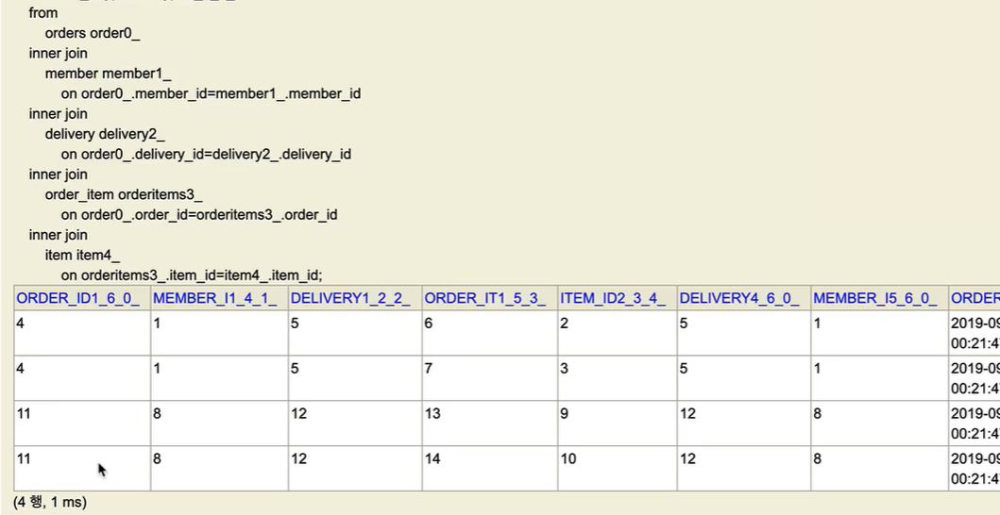

# API 개발 고급 - 컬렉션 조회 최적화

- /주문 조회 V1: 엔티티 직접 노출
- /주문 조회 V2: 엔티티를 DTO로 변환
- /주문 조회 V3: 엔티티를 DTO로 변환 - 페치 조인 최적화
- /주문 조회 V3.1: 엔티티를 DTO로 변환 - 페이징과 한계 돌파
- /페이징과 한계 돌파
- /주문 조회 V4: JPA에서 DTO 직접 조회
- /주문 조회 V5: JPA에서 DTO 직접 조회 - 컬렉션 조회 최적화
- /주문 조회 V6: JPA에서 DTO로 직접 조회, 플랫 데이터 최적화
- /API 개발 고급 정리

위 순서대로 진행한다.

주문내역에서 추가로 주문한 상품 정보를 추가로 조회하자.  
Order 기준으로 컬렉션인 `OrderItem` 와 `Item` 이 필요하다.  

앞의 예제에서는 컬렉션 없이, toOne(OneToOne, ManyToOne) 관계만 있었다.  
이번에는 **컬렉션인 일대다 관계(OneToMany)를 조회하고, 최적화하는 방법을 알아보자.**

## 주문 조회 V1: 엔티티 직접 노출
**OrderApiController**
```java
package jpabook.jpashop.api;

import jpabook.jpashop.domain.Order;
import jpabook.jpashop.domain.OrderItem;
import jpabook.jpashop.repository.OrderRepository;
import jpabook.jpashop.repository.OrderSearch;
import lombok.RequiredArgsConstructor;
import org.springframework.web.bind.annotation.GetMapping;
import org.springframework.web.bind.annotation.RestController;

import java.util.List;

@RestController
@RequiredArgsConstructor
public class OrderApiController {

    private final OrderRepository orderRepository;

    /**
     * 주문 조회 V1. 엔티티 직접 노출
     * - Hibernate5Module 모듈 등록, LAZY=null 처리
     * - 양방향 관계 문제 발생 -> @JsonIgnore
     */
    @GetMapping("/api/v1/orders")
    public List<Order> ordersV1() {
        
        List<Order> all = orderRepository.findAllByString(new OrderSearch());
        
        // 이전에 했던 Lazy 강제 초기화를 해준 것이다.
        for (Order order : all) {
            order.getMember().getName(); //Lazy 강제 초기화
            order.getDelivery().getAddress(); //Lazy 강제 초기화
            
            // 아이템 이름을 가져와야하기 때문에 아이템도 초기화하기 위해 orderItems 를 만든다.
            List<OrderItem> orderItems = order.getOrderItems();
            orderItems.stream().forEach(o -> o.getItem().getName()); //Lazy 강제초기화
        }
        return all;
    }
}
```

```markdown
[
    {
        "id": 1,
        "member": {
            "id": 1,
            "name": "userA",
            "address": {
                "city": "서울",
                "street": "1",
                "zipcode": "1111"
            }
        },
        "orderItems": [
            {
                "id": 1,
                "item": {
                    "id": 1,
                    "name": "JPA1 BOOK",
                    "price": 10000,
                    "stockQuantity": 99,
                    "categories": null,
                    "author": null,
                    "isbn": null
                },
                "orderPrice": 10000,
                "count": 1,
                "totalPrice": 10000
            },
            {
                "id": 2,
                "item": {
                    "id": 2,
                    "name": "JPA2 BOOK",
                    "price": 20000,
                    "stockQuantity": 98,
                    "categories": null,
                    "author": null,
                    "isbn": null
                },
                "orderPrice": 20000,
                "count": 2,
                "totalPrice": 40000
            }
        ],
        "delivery": {
            "id": 1,
            "address": {
                "city": "서울",
                "street": "1",
                "zipcode": "1111"
            },
            "status": null
        },
        "orderDate": "2024-01-15T23:25:13.68457",
        "status": "ORDER",
        "totalPrice": 50000
    },
    {
        "id": 2,
        "member": {
            "id": 2,
            "name": "userB",
            "address": {
                "city": "진주",
                "street": "2",
                "zipcode": "2222"
            }
        },
        "orderItems": [
            {
                "id": 3,
                "item": {
                    "id": 3,
                    "name": "SPRING1 BOOK",
                    "price": 20000,
                    "stockQuantity": 197,
                    "categories": null,
                    "author": null,
                    "isbn": null
                },
                "orderPrice": 20000,
                "count": 3,
                "totalPrice": 60000
            },
            {
                "id": 4,
                "item": {
                    "id": 4,
                    "name": "SPRING2 BOOK",
                    "price": 40000,
                    "stockQuantity": 296,
                    "categories": null,
                    "author": null,
                    "isbn": null
                },
                "orderPrice": 40000,
                "count": 4,
                "totalPrice": 160000
            }
        ],
        "delivery": {
            "id": 2,
            "address": {
                "city": "진주",
                "street": "2",
                "zipcode": "2222"
            },
            "status": null
        },
        "orderDate": "2024-01-15T23:25:14.066217",
        "status": "ORDER",
        "totalPrice": 220000
    }
]
```

postman 으로 api를 보내면 위와 같이 나온다. 주문 안에 orderItem 에 대해 조회할 수 있다.

**V1. 엔티티 직접 노출**
- 엔티티가 변하면 API 스펙이 변한다.
- 트랜잭션 안에서 지연 로딩 필요
- 양방향 연관관계 문제


- `orderItem` , `item` 관계를 직접 초기화하면 `Hibernate5Module` 설정에 의해 엔티티를 JSON으로 생성한다.
- 양방향 연관관계면 무한 루프에 걸리지 않게 한곳에 `@JsonIgnore` 를 추가해야 한다.
- 엔티티를 직접 노출하므로 좋은 방법은 아니다.
- `JpashopApplication` 에 `Hibernate5Module` 에 대해 적혀 있어서 실행할 수 있다.

---
## 주문 조회 V2: 엔티티를 DTO로 변환
**OrderApiController 에 추가**
```java
    @GetMapping("/api/v2/orders")
    public List<OrderDto> ordersV2() {
        List<Order> orders = orderRepository.findAllByString(new OrderSearch());
        List<OrderDto> collect = orders.stream()
                .map(o -> new OrderDto(o))
                .collect(Collectors.toList());

        return collect;
    }
```

**OrderApiController에 추가 2**
```java
    @Data
    static class OrderDto {

        private Long orderId;
        private String name;
        private LocalDateTime orderDate;
        private OrderStatus orderStatus;
        private Address address;
        private List<OrderItem> orderItems;
        public OrderDto(Order order) {
            orderId = order.getId();
            name = order.getMember().getName();
            orderDate = order.getOrderDate();
            orderStatus = order.getStatus();
            address = order.getDelivery().getAddress();
            orderItems = order.getOrderItems();
        }
    }
```

이대로 실행하면 이렇게 나온다.  

orderItems는 엔티티니까 그렇다. -> 좀 지저분해도 보이게 해보자.
```java
    @Data
    static class OrderDto {

        private Long orderId;
        private String name;
        private LocalDateTime orderDate;
        private OrderStatus orderStatus;
        private Address address;
        private List<OrderItem> orderItems;
        public OrderDto(Order order) {
            orderId = order.getId();
            name = order.getMember().getName();
            orderDate = order.getOrderDate();
            orderStatus = order.getStatus();
            address = order.getDelivery().getAddress();
            order.getOrderItems().stream().forEach(o -> o.getItem().getName());
            orderItems = order.getOrderItems();
        }
    }
```

이렇게 해도 될까? -> 안 된다.  
엔티티를 노출하는 것이 아닌 이것 또한 Dto로 받아서 해야 한다.
```java
    @Data
static class OrderDto {

    private Long orderId;
    private String name;
    private LocalDateTime orderDate;
    private OrderStatus orderStatus;
    private Address address;
    private List<OrderItemDto> orderItems;
    public OrderDto(Order order) {
        orderId = order.getId();
        name = order.getMember().getName();
        orderDate = order.getOrderDate();
        orderStatus = order.getStatus();
        address = order.getDelivery().getAddress();
        orderItems = order.getOrderItems().stream()
                .map(orderItem -> new OrderItemDto(orderItem))
                .collect(Collectors.toList());
    }
}

@Data
static class OrderItemDto {

    private String itemName;//상품 명
    private int orderPrice; //주문 가격
    private int count; //주문 수량

    public OrderItemDto(OrderItem orderItem) {
        itemName = orderItem.getItem().getName();
        orderPrice = orderItem.getOrderPrice();
        count = orderItem.getCount();
    }
}
```

- 지연 로딩으로 너무 많은 SQL 실행
- SQL 실행 수
  - `order` 1번 조회
  - `member` , `address` N번(order 조회 수 만큼)
  - `orderItem` N번(order 조회 수 만큼)
  - `item` N번(orderItem 조회 수 만큼)

> 참고: 지연 로딩은 영속성 컨텍스트에 있으면 영속성 컨텍스트에 있는 엔티티를 사용하고 없으면 SQL을 실행한다.  
> 따라서 같은 영속성 컨텍스트에서 이미 로딩한 회원 엔티티를 추가로 조회하면 SQL을 실행하지 않는다.

---
## 주문 조회 V3.1: 엔티티를 DTO로 변환 - 페치 조인 최적화
**OrderApiController 에 추가**
```java
    @GetMapping("/api/v3/orders")
    public List<OrderDto> ordersV3() {
        List<Order> orders = orderRepository.findAllWithItem();
        List<OrderDto> result = orders.stream()
                .map(o -> new OrderDto(o))
                .collect(toList());
        
        return result;
    }
```

**OrderRepository에 추가**
```java
    public List<Order> findAllWithItem() {
        return em.createQuery(
                "select distinct o from Order o" +
                        " join fetch o.member m" +
                        " join fetch o.delivery d" +
                        // 이 아래 orderItems 부분부터는 예제에서의 데이터 양이 order가 2개일 때, orderItem이 4개이다.
                        // order 와 orderItems를 조인하면서 2개였던 order가 4개로 데이터 양이 늘어난다.
                        " join fetch o.orderItems oi" +
                        " join fetch oi.item i", Order.class).getResultList();
    }
```

`distinct` **사용 이전**의 결과 사진  
  
  

order 와 orderItems를 조인하면서 2개였던 order가 4개로 데이터 양이 늘어난다. (심지어 중복이다.)   
DB 입장에서는 데이터가 늘어났지만, Hibernate 입장에서는 모른다.  
이걸 해결하기 위해서는 `distinct` 을 사용하자.  

- 페치 조인으로 SQL이 1번만 실행됨 
- `distinct` 를 사용한 이유는 1대다 조인이 있으므로 데이터베이스 row가 증가한다. 그 결과 같은 order 엔티티의 조회 수도 증가하게 된다.  
JPA의 distinct는 SQL에 distinct를 추가하고, 더해서 같은 엔티티가 조회되면, 애플리케이션에서 중복을 걸러준다.  
이 예에서 order가 컬렉션 페치 조인 때문에 중복 조회 되는 것을 막아준다.
- 단점 
  - 페이징 불가능

> 참고: **컬렉션 페치 조인을 사용하면 페이징이 불가능**하다.  
> 하이버네이트는 경고 로그를 남기면서 모든 데이터를 DB에서 읽어오고, 메모리에서 페이징 해버린다(매우 위험하다).  
> 자세한 내용은 자바 ORM 표준 JPA 프로그래밍의 페치 조인 부분을 참고하자.

> 참고: **컬렉션 페치 조인은 1개만 사용할 수 있다.** 컬렉션 둘 이상에 페치 조인을 사용하면 안된다.  
> 데이터가 부정합하게 조회될 수 있다. 자세한 내용은 자바 ORM 표준 JPA 프로그래밍을 참고하자.  

---
## 주문 조회 V3.1: 엔티티를 DTO로 변환 - 페이징과 한계 돌파
## 페이징과 한계 돌파
- 컬렉션을 페치 조인하면 페이징이 불가능하다.
  - 컬렉션을 페치 조인하면 일대다 조인이 발생하므로 데이터가 예측할 수 없이 증가한다.
  - 일대다에서 일(1)을 기준으로 페이징을 하는 것이 목적이다. 그런데 데이터는 다(N)를 기준으로 row가 생성된다.
  - Order를 기준으로 페이징 하고 싶은데, 다(N)인 OrderItem을 조인하면 OrderItem이 기준이 되어버린다.
  - (더 자세한 내용은 자바 ORM 표준 JPA 프로그래밍 - 페치 조인 한계 참조)
- 이 경우 하이버네이트는 경고 로그를 남기고 모든 DB 데이터를 읽어서 메모리에서 페이징을 시도한다. 최악의 경우 장애로 이어질 수 있다.

### 한계 돌파
그러면 페이징 + 컬렉션 엔티티를 함께 조회하려면 어떻게 해야 할까?  
지금부터 코드도 단순하고, 성능 최적화도 보장하는 매우 강력한 방법을 소개하겠다. 대부분의 페이징 + 컬렉션 엔티티 조회 문제는 이 방법으로 해결할 수 있다.  

- 먼저 **ToOne**(OneToOne, ManyToOne) 관계를 모두 페치조인 한다. ToOne 관계는 row 수를 증가시키지 않으므로 페이징 쿼리에 영향을 주지 않는다.
- **컬렉션은 지연 로딩으로 조회**한다.
- 지연 로딩 성능 최적화를 위해 `hibernate.default_batch_fetch_size` , `@BatchSize` 를 적용한다.
  - hibernate.default_batch_fetch_size: 글로벌 설정 (정해둔 개수만큼 가져온다.)
  - @BatchSize: 개별 최적화
  - 이 옵션을 사용하면 컬렉션이나, 프록시 객체를 한꺼번에 설정한 size 만큼 IN 쿼리로 조회한다.

OrderRepository에 추가
```java
    public List<Order> findAllWithMemberDelivery(int offset, int limit) {
        return em.createQuery(
                        "select o from Order o" +
                                " join fetch o.member m" +
                                " join fetch o.delivery d", Order.class)
                .setFirstResult(offset)
                .setMaxResults(limit)
                .getResultList();
    }
```

**OrderApiController 에 추가**
```java
    @GetMapping("/api/v3.1/orders")
    public List<OrderDto> ordersV3_Page(@RequestParam(value = "offset", defaultValue = "0") int offset,
                                        @RequestParam(value = "limit", defaultValue = "100") int limit) {
        List<Order> orders = orderRepository.findAllWithMemberDelivery(offset, limit);
        List<OrderDto> result = orders.stream()
                .map(o -> new OrderDto(o))
                .collect(toList());

        return result;
    }
```

**최적화 옵션**
```yaml
  jpa:
    properties:
      hibernate:
        default_batch_fetch_size: 1000
```
- 개별로 설정하려면 `@BatchSize` 를 적용하면 된다. (컬렉션은 컬렉션 필드에, 엔티티는 엔티티 클래스에 적용)
- yml 파일에 `default_batch_fetch_size` 를 적는 것을 권장하긴 한다.

위의 코드를 실행하면 order에 대한 쿼리는 이전 것과 limit에 대한 내용을 제외하고는 똑같다.  
  
2번째 쿼리인 orderItem 에 대한 쿼리는 이런 식으로 약간 이상하다.  `order_id in` 에 대한 부분이 있는데 더 살펴보면  
한 번의 in 쿼리로 db에 있는 userA, userB의 orderItems를 가지고 온 것이다.  
yml 파일에서 `default_batch_fetch_size: 1000` 이 부분이 in 쿼리를 가져오는 개수를 뜻한다.


- **장점**
- 쿼리 호출 수가 `1 + N` -> `1 + 1` 로 최적화 된다.
- 조인보다 DB 데이터 전송량이 최적화 된다. (Order와 OrderItem을 조인하면 Order가 OrderItem 만큼 중복해서 조회된다. 이 방법은 각각 조회하므로 전송해야할 중복 데이터가 없다.)
- 페치 조인 방식과 비교해서 쿼리 호출 수가 약간 증가하지만, DB 데이터 전송량이 감소한다.
- 컬렉션 페치 조인은 페이징이 불가능 하지만 이 방법은 페이징이 가능하다.


- **결론**
  - ToOne 관계는 페치 조인해도 페이징에 영향을 주지 않는다.  
  - 따라서 ToOne 관계는 페치조인으로 쿼리 수를 줄이고 해결하고, 나머지는 `hibernate.default_batch_fetch_size` 로 최적화 하자.

> **참고**: `default_batch_fetch_size` 의 크기는 적당한 사이즈를 골라야 하는데, 100~1000 사이를 선택하는 것을 권장한다.  
> 이 전략을 SQL IN 절을 사용하는데, 데이터베이스에 따라 IN 절 파라미터를 1000으로 제한하기도 한다.  
> 1000으로 잡으면 한번에 1000개를 DB에서 애플리케이션에 불러오므로 DB에 순간 부하가 증가할 수 있다.  
> 하지만 애플리케이션은 100이든 1000이든 결국 전체 데이터를 로딩해야 하므로 메모리 사용량이 같다.  
> 1000으로 설정하는 것이 성능상 가장 좋지만, 결국 DB든 애플리케이션이든 순간 부하를 어디까지 견딜 수 있는 지로 결정하면 된다.

---
### 참고 - 스프링 부트 3.1 - 하이버네이트 6.2 변경사항 - array_contains
스프링 부트 3.1 부터는 하이버네이트 6.2를 사용한다.  
하이버네이트 6.2 부터는 `where in` 대신에 `array_contains` 를 사용한다.  

**where in 사용 문법** 
```
where item.item_id in(?,?,?,?)
```

**array_contains 사용 문법** 
```
where array_contains(?,item.item_id)
```
참고로 `where in` 에서 `array_contains` 를 사용하도록 변경해도 결과는 완전히 동일하다. 그런데 이렇게 변경하는 이유는 성능 최적화 때문이다.  

`select ... where item.item_id in(?)`
이러한 SQL을 실행할 때 데이터베이스는 SQL 구문을 이해하기 위해 SQL을 파싱하고 분석하는 등 여러가지 복잡한 일을 처리해야 한다.  
그래서 성능을 최적화하기 위해 이미 실행된 SQL 구문은 파싱된 결과를 내부에 캐싱하고 있다.  
이렇게 해두면 이후에 같은 모양의 SQL이 실행되어도 이미 파싱된 결과를 그대로 사용해서 성능을 최적화 할 수 있다.  

> 참고로 여기서 말하는 캐싱은 SQL 구문 자체를 캐싱한다는 뜻이지 SQL의 실행 결과를 캐싱한다는 뜻이 아니다.  
SQL 구문 차제를 캐싱하기 때문에 여기서 ? 에 바인딩 되는 데이터는 변경되어도 캐싱된 SQL 결과를 그대로 사용할 수 있다.

그런데 where in 쿼리는 동적으로 데이터가 변하는 것을 넘어서 SQL 구문 자체가 변해버리는 문제가 발생한다.  
다음 예시는 in에 들어가는 데이터 숫자에 따라서 총 3개의 SQL구문이 생성된다.  
```
where item.item_id in(?)
where item.item_id in(?,?)
where item.item_id in(?,?,?,?)
```
SQL 입장에서는 `?` 로 바인딩 되는 숫자 자체가 다르기 때문에 완전히 다른 SQL이다.  
따라서 총 3개의 SQL 구문이 만들어지고, 캐싱도 3개를 따로 해야한다. 이렇게 되면 성능 관점에서 좋지 않다.  

`array_contains` **를 사용하면 이런 문제를 깔끔하게 해결할 수 있다.**  
이 문법은 결과적으로 `where in` 과 동일하다. `array_contains` 은 왼쪽에 배열을 넣는데, 배열에 들어있는 숫자가 오른쪽(item_id)에 있다면 참이 된다.  

예시) 다음 둘은 같다.  
```
select ... where array_contains([1,2,3],item.item_id)
select ... item.item_id where in(1,2,3)
```

이 문법은 ?에 바인딩 되는 것이 딱1개 이다.. 배열1개가 들어가는 것이다.
`select ... where array_contains(?,item.item_id)`

따라서 배열에 들어가는 데이터가 늘어도 SQL 구문 자체가 변하지 않는다. ? 에는 배열 하나만 들어가면 된다.  


이런 방법을 사용하면 앞서 이야기한 동적으로 늘어나는 SQL 구문을 걱정하지 않아도 된다.  
결과적으로 데이터가 동적으로 늘어나도 같은 SQL 구문을 그대로 사용해서 성능을 최적화 할 수 있다.  


참고로 `array_contains` 에서 `default_batch_fetch_size` 에 맞추어 **배열에 null 값을 추가**하는데, 이 부분은 아마도 특정 데이터베이스에 따라서 **배열의 데이터 숫자가 같아야 최적화가 되기 때문에 그런 것으로 추정된다.**

---
## 주문 조회 V4: JPA에서 DTO 직접 조회
**OrderApiController 에 추가**
```java
    private final OrderQueryRepository orderQueryRepository;    

    @GetMapping("/api/v4/orders")
    public List<OrderQueryDto> ordersV4() {
        return orderQueryRepository.findOrderQueryDtos();
    }
```

repository.order.query 패키지에 OrderQueryRepository 생성
```java
package jpabook.jpashop.repository.order.query;

import jakarta.persistence.EntityManager;
import lombok.RequiredArgsConstructor;
import org.springframework.stereotype.Repository;

import java.util.List;

@Repository
@RequiredArgsConstructor
public class OrderQueryRepository {

    private EntityManager em;

    /**
     * 컬렉션은 별도로 조회
     * Query: 루트 1번, 컬렉션 N 번
     * 단건 조회에서 많이 사용하는 방식
     */
    public List<OrderQueryDto> findOrderQueryDtos() {
        List<OrderQueryDto> result = findOrders();

        result.forEach(o -> {
            List<OrderItemQueryDto> orderItems = findOrderItems(o.getOrderId());
            o.setOrderItems(orderItems);
        });

        return result;
    }

    /**
     * 1:N 관계인 orderItems 조회
     */
    private List<OrderItemQueryDto> findOrderItems(Long orderId) {
        return em.createQuery(
                "select new jpabook.jpashop.repository.order.query.OrderItemQueryDto(oi.order.id, i.name, oi.orderPrice, oi.count)" +
                        " from OrderItem oi" +
                        " join oi.item i" +
                        " where oi.order.id = :orderId", OrderItemQueryDto.class)
                .setParameter("orderId", orderId)
                .getResultList();
    }

    /**
     * 1:N 관계(컬렉션)를 제외한 나머지를 한번에 조회
     */
    private List<OrderQueryDto> findOrders() {
        return em.createQuery(
                        "select new jpabook.jpashop.repository.order.query.OrderQueryDto(o.id, m.name, o.orderDate, o.status, d.address)" +
                                " from Order o" +
                                " join o.member m" +
                                " join o.delivery d", OrderQueryDto.class)
                .getResultList();
    }
}
```

**OrderQueryDto**
```java
package jpabook.jpashop.repository.order.query;

import jpabook.jpashop.domain.Address;
import jpabook.jpashop.domain.OrderStatus;
import lombok.Data;
import lombok.EqualsAndHashCode;

import java.time.LocalDateTime;
import java.util.List;

@Data
@EqualsAndHashCode(of = "orderId")
public class OrderQueryDto {

    private Long orderId;
    private String name;
    private LocalDateTime orderDate; //주문시간
    private OrderStatus orderStatus;
    private Address address;
    private List<OrderItemQueryDto> orderItems;

    public OrderQueryDto(Long orderId, String name, LocalDateTime orderDate, OrderStatus orderStatus, Address address) {
        this.orderId = orderId;
        this.name = name;
        this.orderDate = orderDate;
        this.orderStatus = orderStatus;
        this.address = address;
    }
}
```

**OrderItemQueryDto**
```java
package jpabook.jpashop.repository.order.query;

import com.fasterxml.jackson.annotation.JsonIgnore;
import lombok.Data;

@Data
public class OrderItemQueryDto {

    @JsonIgnore
    private Long orderId;
    private String itemName;
    private int orderPrice;
    private int count;

    public OrderItemQueryDto(Long orderId, String itemName, int orderPrice, int count) {
        this.orderId = orderId;
        this.itemName = itemName;
        this.orderPrice = orderPrice;
        this.count = count;
    }
}
```

- Query : 루트 1번, 컬렉션 N 번 실행 
- (findOrders 로 order 1번, findOrderItems 에서 orderItem을 기준으로 orderItem 1번과 조인된 item을 1번 가져온다.)
  - findORders 로 1번이지만 -> 예제는 2개이다. 즉, n개
  - 컬렉션인 orderItem, item 때문에 n번
    - n+n 문제가 터진다.
- ToOne(N:1, 1:1) 관계들을 먼저 조회하고, ToMany(1:N) 관계는 각각 별도로 처리한다.
  - 이런 방식을 선택한 이유는 다음과 같다.
  - ToOne 관계는 조인해도 데이터 row 수가 증가하지 않는다.
  - ToMany(1:N) 관계는 조인하면 row 수가 증가한다.
- row 수가 증가하지 않는 ToOne 관계는 조인으로 최적화 하기 쉬우므로 한번에 조회하고, ToMany 관계는 최적화 하기 어려우므로 findOrderItems() 같은 별도의 메서드로 조회한다.

---
## 주문 조회 V5: JPA에서 DTO 직접 조회 - 컬렉션 조회 최적화
OrderApiController에 추가
```java
    @GetMapping("/api/v5/orders")
    public List<OrderQueryDto> ordersV5() {
        return orderQueryRepository.findAllByDto_optimization();
    }
```

OrderQueryRepository에 추가
```java
/**
 * 최적화
 * Query: 루트 1번, 컬렉션 1번
 * 데이터를 한꺼번에 처리할 때 많이 사용하는 방식
 *
 */
    public List<OrderQueryDto> findAllByDto_optimization() {
        // 루트 조회(toOne 코드를 모두 한번에 조회)
        List<OrderQueryDto> result = findOrders();

        // orderId로 바꾸면 orderId의 리스트가 된다.
        List<Long> orderIds = result.stream()
                .map(o -> o.getOrderId())
                .collect(Collectors.toList());

        // 쿼리 한 번으로 orderItems를 만든다.
        List<OrderItemQueryDto> orderItems = em.createQuery(
                "select new jpabook.jpashop.repository.order.query.OrderItemQueryDto(oi.order.id, i.name, oi.orderPrice, oi.count)" +
                        " from OrderItem oi" +
                        " join oi.item i" +
                        " where oi.order.id in :orderIds", OrderItemQueryDto.class)
                .setParameter("orderIds", orderIds)
                .getResultList();

        // orderItems를 map으로 바꿔서 최적화해보자.
        // orderItem 컬렉션을 MAP 한방에 조회
        Map<Long, List<OrderItemQueryDto>> orderItemMap = orderItems.stream()
                .collect(Collectors.groupingBy(orderItemQueryDto -> orderItemQueryDto.getOrderId()));

        // 메모리에 map으로 매칭해서 값을 세팅해준다.
        // 루프를 돌면서 컬렉션 추가(추가 쿼리 실행X)
        result.forEach(o -> o.setOrderItems(orderItemMap.get(o.getOrderId())));

        return result;
    }
```

실행 시 나오는 쿼리 (findOrders 부분)  
  

`orderIds` 부분은 Id를 추출한 것이기 때문에 쿼리가 나오지 않는다.  

`orderItems` 부분의 쿼리를 보자.  
  

이후 `orderItems`를 Map으로 바꿔주고 Order에 대해 루프를 돌리면서 `Order.setOrderItems` 에 `orderItemMap.get(o.getOrderId())`  
즉, 메모리에 맵을 올려뒀다.  
이렇게 하면 쿼리 2번으로 최적화할 수 있다.  

OrderQueryRepository 코드 수정
```java
    public List<OrderQueryDto> findAllByDto_optimization() {
        // 루트 조회(toOne 코드를 모두 한번에 조회)
        List<OrderQueryDto> result = findOrders();

        Map<Long, List<OrderItemQueryDto>> orderItemMap = findOrderItemMap(toOrderIds(result));

        // 메모리에 map으로 매칭해서 값을 세팅해준다.
        // 루프를 돌면서 컬렉션 추가(추가 쿼리 실행X)
        result.forEach(o -> o.setOrderItems(orderItemMap.get(o.getOrderId())));

        return result;
    }

    private Map<Long, List<OrderItemQueryDto>> findOrderItemMap(List<Long> orderIds) {
        // 쿼리 한 번으로 orderItems를 만든다.
        List<OrderItemQueryDto> orderItems = em.createQuery(
                "select new jpabook.jpashop.repository.order.query.OrderItemQueryDto(oi.order.id, i.name, oi.orderPrice, oi.count)" +
                        " from OrderItem oi" +
                        " join oi.item i" +
                        " where oi.order.id in :orderIds", OrderItemQueryDto.class)
                .setParameter("orderIds", orderIds)
                .getResultList();

        // orderItems를 map으로 바꿔서 최적화해보자.
        // orderItem 컬렉션을 MAP 한방에 조회
        Map<Long, List<OrderItemQueryDto>> orderItemMap = orderItems.stream()
                .collect(Collectors.groupingBy(orderItemQueryDto -> orderItemQueryDto.getOrderId()));
        return orderItemMap;
    }

    private static List<Long> toOrderIds(List<OrderQueryDto> result) {
        // orderId로 바꾸면 orderId의 리스트가 된다.
        List<Long> orderIds = result.stream()
                .map(o -> o.getOrderId())
                .collect(Collectors.toList());
        return orderIds;
    }
```
외부 메서드로 이동시켜줬다.  

- Query: 루트 1번, 컬렉션 1번
- ToOne 관계들을 먼저 조회하고, 여기서 얻은 식별자 orderId로 ToMany 관계인 `OrderItem` 을 한꺼번에 조회
- MAP을 사용해서 매칭 성능 향상(O(1))

직접 JPA로 컬렉션 조회 최적화하는게 그렇게 편해보이지는 않는다.  
대신 성능 향상으로 이전 페치 조인보다 쿼리의 양은 줄어든다.  
V6에서는 쿼리 1번으로 해결해볼 것이다.  

---